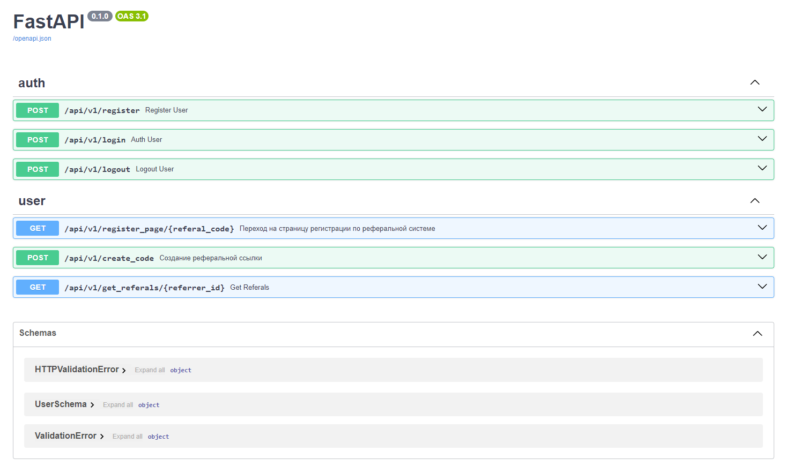

# Referal system API


Описание:<br>
Серверная часть:<br>
RESTful API на Python с использованием фреймворка fastapi.

Эндпоинты:<br>
**POST** */api/v1/register/*: регистрация пользователя.<br>
Входные параметры: *почта (email)*, *пароль (password)*.<br>
**POST** */api/v1/login*: вход.<br>
**POST** */api/v1/logout*: выход.<br>
**GET** */api/v1/register_page/{referal_code}*: запрос для перехода на страницу с регистрацией, чтобы сохранить код в куки.<br>
**POST** */api/v1/create_code*: создание реферального кода.<br>
**GET** */api/v1/get_referals/{referrer_id}*: получение рефералов по id реферрера.


## Список примененных технологий:
- fastapi
- postgresql
- sqlalchemy
- pytest
- pydantic
- jwt


## Описание кода
```cmd
alembic/ - миграции
```
```cmd
/app/core - конфиг
/app/database - все связанное с БД (sqlalchemy модели, репозитории, сессия)
/app/logs - логи
/app/routers - все роуты, что есть в проекте
/app/schemas - схемы (в данном случае только схема пользователя)
/app/utils - вспомогательная директория, в данном случае в ней находится вспомогательный для аутентификации код
```
```cmd
tests/ - тесты API
```


## 🛠️ Для установки и запуска сервиса локально, нужно выполнить следующие действия:

- Клонирование репозитория
Клонируйте репозиторий проекта на свой локальный компьютер:
```cmd
git clone https://github.com/someqst/referal_system.git
cd referal_system/
```

- Настройка переменных окружения
Переименуйте файл .env.example в .env

- Установите необходимые зависимости
```cmd
pip install -r requirements.txt
```
- Создайте базу данных
- Запустите приложение:
```cmd
uvicorn app.main:app --host 0.0.0.0 --port 8000 --reload
```
После запуска проект будет доступен по адресу: http://127.0.0.1:8000

- Документация API
Документация автоматически генерируется FastAPI и доступна по адресу:

Swagger UI: http://127.0.0.1:8000/docs


# Swagger
<picture>
  <source media="(prefers-color-scheme: dark)" srcset="./api_pictures/image.jpg">
  
</picture>
